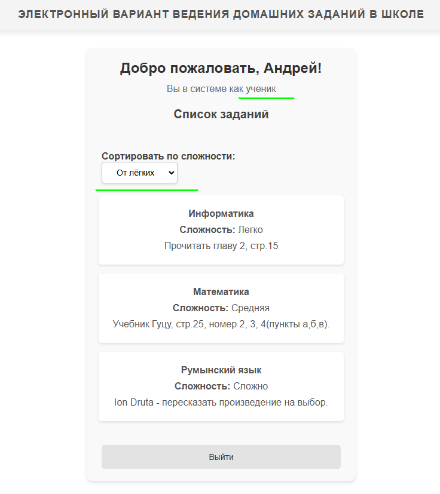
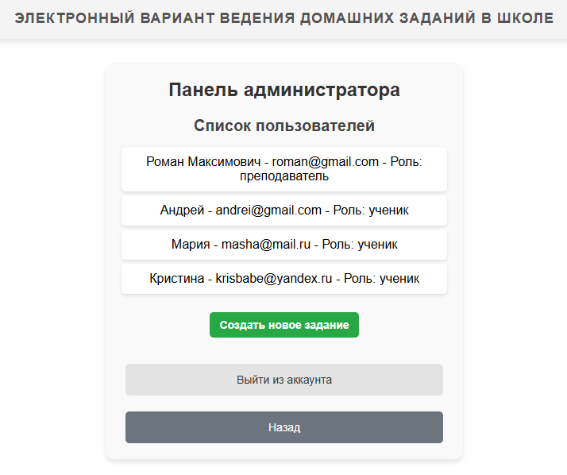

# Индивидуальная работа

## Тема проекта: Электронный вариант ведения домашних заданий в школе

Работа выполнена на языке `PHP 8.2` с помощью фреймворка `Laravel v.10` и базы данных `MySQL 8.0`.

Автор: **Ceaplinschi Roman,** IA-2202.

### Описание проекта

**Главная задача:**
Создать удобное веб-приложение для управления домашними заданиями, которое позволяет преподавателям добавлять, редактировать и удалять задания, а ученикам — просматривать их. Система поддерживает распределение прав доступа между пользователями в зависимости от их роли (ученик или преподаватель).

Этот проект предоставляет удобный инструмент для управления учебным процессом, подходящий как для индивидуального обучения, так и для школьных классов.

**Основные функции:**

**Для всех пользователей:**

- Регистрация и аутентификация.
- Просмотр списка домашних заданий.
- Возможность сортировки заданий по уровню сложности (легкий, средний, сложный).
- Информация о задании включает предмет, описание, сложность.

**Для учеников:**

- Только чтение контента без возможности его редактирования.
- Личный кабинет с информацией о пользователе.

**Для преподавателей:**

- Добавление нового задания: указание предмета, описания, уровня сложности.
- Редактирование существующих заданий.
- Удаление заданий.
- Доступ к панели администратора, где отображается список всех пользователей с указанием их ролей.
- Возможность редактирования ролей пользователей.

### Примеры использования проекта

`Welcome Page` сразу предлагает авторизоваться пользователю, если у него есть аккаунт. Если аккаунта нет - под формой предложена альтернатива в виде регистрации.


Вся логика работы аккаунтов вместе с настроенными маршрутами, ролями `(user, admin)` и т.д. взята из лабораторной работы номер 5.

С помощью основного компонента представления `views/layouts/app.blade.php` настроен `header` и `footer` соответственно, на страницах меняется лишь секция `@yield('content')`.

Зайдя в систему как ученик (в базе данных - `user`), случится перенаправление в личный кабинет со всеми его функциями.



Так как в базе данных ученик имеет роль `user`, а преподаватель `admin` в модели создана функция для правильного отображения смысловой роли в личном кабинете.

```php
public function getReadableRole()
    {
        $roles = [
            'admin' => 'преподаватель',
            'user' => 'ученик',
        ];
        
        return $roles[$this->role];
    }
```

Так же немало важно отметить возможность сортировки, реализованная в `HomeController` с использованием формы с методом `GET` и функции контроллера:
```php
public function index(Request $request)
    {
        // Определяем, по какой сложности будем сортировать
        $sortOrder = $request->get('difficulty', 'asc');

        $assignments = Assignment::with('subject')
            ->orderBy('difficulty', $sortOrder)
            ->get();

        return view('home', compact('assignments'));
    }
```

Зайдя в систему как преподаватель, представление `home.blade.php` заиграет новыми красками.

Обратить внимание стоит на то, что представления для ученика и преподавателя - это один файл, в котором перед отображением определённых секций срабатывает проверка на роль аутентифицированного пользователя.


Реализована проверка так:

```php
@if(Auth::user()->isAdmin())
    <p><a href="{{ route('admin') }}" class="admin-link">Перейти в панель преподавателя</a></p>
@endif
```

В админ-панели преподаватель может видеть всех зарегистрированных пользователей вместе с их ролями, а так же задавать новые домашние задания ученикам.



Для того, чтоб новое задание было успешно добавлено в базу данных, необходимо заполнить все поля включая предмет, описание и уровень сложности, а потом пройти валидацию в контроллере `AssignmentController`:

```php
$request->validate([
            'description' => 'required|string|max:100',
            'difficulty' => 'required|in:easy,medium,hard',
            'subject_id' => 'required|exists:subjects,id',
        ]);
```


Редактирование происходит аналогичным образом с такой же валидацией.

### Возможные улучшения

Проект уже включает базовую функциональность, но его можно расширить для повышения удобства и функциональности, например добавив интеграцию с API для уведомлений.

Подключение `Tailwind CSS` могло бы значительно улучшить внешний вид проекта.

Библиотеки по типу `Laravel Breeze` могли бы ускорить реализацию существования аккаунтов с готовыми формами и маршрутами.

Интеграция с календарем могла бы неплохо вписаться отображения дедлайнов выполнения заданий.

### Список использованных источников

1. https://github.com/MSU-Courses/frameworks-for-web-development/tree/main/ru
2. https://laravel.com/docs/10.x/readme
3. https://www.php.net/docs.php
4. https://dev.mysql.com/doc/
5. https://laracasts.com/discuss


