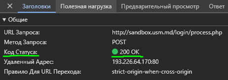

# Лабораторная работа 1.

## Задание 1.

### После введения неверных данных в поле для входа на сайте http://sandbox.usm.md/login/ появляются следующие результаты:

* #### Для отправки запроса использовался метод POST.
  * 
* #### Были отправлены следующие заголовки:
  * 
* #### Были отправлены следующие параметры:
  * 
* #### Код состояния сервера:
  * 
* #### Заголовки, отправленные в ответе:
  * 

### После введения ВЕРНЫХ данных:

* #### Для отправки запроса использовался метод POST.
  * 
* #### Были отправлены следующие заголовки:
  * 
* #### Были отправлены следующие параметры:
  * 
* #### Код состояния сервера:
  * 
* #### Заголовки, отправленные в ответе:
  * 

## Задание 2.

```
GET / HTTP/1.1
Host: http://sandbox.com
User-Agent: Ceaplinschi Roman
```

```
POST /cars HTTP/1.1
Host: http://sandbox.com
User-Agent: Ceaplinschi Roman
make=Honda&model=Accord&year=2000
```

```
PUT /cars/1 HTTP/1.1
Host: sandbox.com
Content-Type: application/json
User-Agent: Ceaplinschi Roman

{
    "make": "Honda",
    "model": "Accord",
    "year": 2024
}
```

```
HTTP/1.1 201 Created
Content-Type: application/json
Location: /cars/1
Date: Mon, 18 Sep 2024

{
  "message": "Car was created successfully",
  "data": {
    "id": 1,
    "make": "Honda",
    "model": "Accord",
    "year": 2000
  }
}
```

### Коды состояния сервера.
#### Когда сервер может вернуть 200, 201 ?

#### Когда сервер может вернуть 400, 401, 403, 404 ?

* #### Когда сервер может вернуть 500 ?
