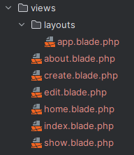
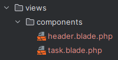
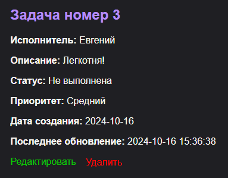

# Лабораторная №2
### №1. Подготовка к работе, установка Laravel
**Вопрос**: Что вы видите в браузере, открыв страницу `http://localhost:8000`?

**Ответ**: Стартовую страницу `Laravel` с контентом `Documentation`, `Laravel News`, `Laracasts`, `Vibrant Ecosystem`.


### №2. Настройка окружения
Сгенерируем ключ приложения.
   ```ini
   APP_KEY=base64:9bQ1AVUaO13cHqiHqsn424u8htj0S7YLSKsUPsFIVRU=
   ```
**Вопрос**: Что будет, если данный ключ попадет в руки злоумышленника?

**Ответ**: Конфиденциальные данные могут быть расшифрованы, сессии и cookies могут быть подделаны/взломаны, возможны CSRF (Cross-Site Request Forgery) атаки.

### №3. Основы работы с HTTP-запросами

#### №3.1. Создание маршрутов для главной страницы и страницы "О нас"
**Home Controller**:
```injectablephp
public function index()
{
     return view('home');  // home.blade.php
}
    
public function about()
{
    return view('about');  // about.blade.php
}
```
**Маршруты**:
```injectablephp
// для главной страницы
Route::get('/', [HomeController::class, 'index'])->name('start');

// для страницы "О нас"
Route::get('/about', [HomeController::class, 'about'])->name('about');
```

#### №3.2. Создание маршрутов для задач
**Task Controller**:
```injectablephp
public function index()
{
    return view('index');
}

public function show($id)
{
    return "This is task with ID: {$id}";
}

public function create()
{

}

public function store()
{

}

public function edit($id)
{

}

public function update($id)
{

}

public function destroy($id)
{

}
```
**Маршруты**:

| Метод  | Описание                     |
|--------|------------------------------|
| GET    | Получить данные   |
| POST   | Создать новые данные         |
| PUT    | Обновить существующие данные |
| DELETE | Удалить данные               |

```injectablephp
Route::prefix('tasks')->group(function () {
    // Отображение списка задач
    Route::get('/', [TaskController::class, 'index'])
        ->name('tasks.index');

    // Отображение конкретной задачи
    Route::get('/{id}', [TaskController::class, 'show'])
        ->name('tasks.show')
        ->where('id', '[0-9]+');

    // Отображение формы для создания новой задачи
    Route::get('/create', [TaskController::class, 'create'])
        ->name('tasks.create');

    // Сохранение новой задачи
    Route::post('/', [TaskController::class, 'store'])
        ->name('tasks.store');

    // Отображение формы редактирования задачи
    Route::get('/{id}/edit', [TaskController::class, 'edit'])
        ->name('tasks.edit')
        ->where('id', '[0-9]+');

    // Обновление задачи
    Route::put('/{id}', [TaskController::class, 'update'])
        ->name('tasks.update')
        ->where('id', '[0-9]+');

    // Удаление задачи
    Route::delete('/{id}', [TaskController::class, 'destroy'])
        ->name('tasks.destroy')
        ->where('id', '[0-9]+');
});
```
Проверим созданные маршруты с помощью команды `php artisan route:list`:
```
GET|HEAD   tasks..............tasks.index › TaskController@index 
POST       tasks.............. tasks.store › TaskController@store  
GET|HEAD   tasks/create....... tasks.create › TaskController@create  
GET|HEAD   tasks/{id}......... tasks.show › TaskController@show  
PUT        tasks/{id}......... tasks.update › TaskController@update  
DELETE     tasks/{id}......... tasks.destroy › TaskController@destroy  
GET|HEAD   tasks/{id}/edit.... tasks.edit › TaskController@edit
```

Попробуем заменить ручной ввод на ресурсный контроллер:
```php
Route::resource('tasks', TaskController::class)
    ->parameters(['tasks' => 'id']) // использовать 'id' в качестве имени параметра
    ->where(['id' => '[0-9]+']);
```
Как итог - получили аналогичные ручному вводу маршруты.

#### Разница между ручным созданием маршрутов и использованием ресурсного контроллера
1. **Ручное создание маршрутов**:
* Каждый маршрут нужно объявлять отдельно -> много кода.
* Необходимость вручную писать каждое действие `(GET, POST, PUT, DELETE)`.
* Требуется следить за правильностью имён маршрутов.
* Увеличивает вероятность ошибок (человеческий фактор).

2. **Использование ресурсного контроллера**:
* Создает маршруты для всех операций **CRUD (Create, Read, Update, Delete)** одним вызовом.
* Автоматически генерирует стандартные имена маршрутов.
* Упрощает чтение и поддержку кода, особенно в больших проектах.
* Встроенная поддержка `RESTful` подхода, что улучшает структуру приложения.

### №4. Шаблонизация с использованием Blade

**Структура представлений**:



Как шаблон используем `app.blade.php` , где `<header>` и `<footer>` будут одинаковыми, а секцию `<main>` будем запонять с помощью директивы `@yield`.

Поскольку мы пока не работаем с базой данных, используя статические данные, изменим код контроллера тасков.

На примере основной страницы со всеми тасками:

```php
public function index()
    {
        $tasks = [
            ['id' => 1, 'title' => 'Сдать аттестации', 'description' => 'Фреймворки, 2D-графика, Wolfram'],
            ['id' => 2, 'title' => 'Забрать посылки', 'description' => 'Почта Молдовы, Новапошта, DHL'],
            ['id' => 3, 'title' => 'Уборка квартиры', 'description' => 'Пропылесосить, вымыть полы, вытереть пыль'],
        ];

        return view('index', ['tasks' => $tasks]);
    }
```

Шаблон `index.blade.php`:
```php
@extends('layouts.app')

@section('title', 'Список задач')

@section('content')
    <h2>Список задач</h2>

    <ul>
        @foreach ($tasks as $task)
            <li>
                <a href="{{ route('tasks.show', ['id' => $task['id']]) }}"> {{ $task['title'] }}</a>
                <p>{{ $task['description'] }}</p>
            </li>
        @endforeach
    </ul>
@endsection
```

Аналогично для каждого из представлений. Подробно каждый файл можно увидеть в папке самого проекта.

#### №4.2. Анонимные компоненты Blade

Дополним директорию `views` новой папкой `components`



Анонимный компонент для отображения шапки `header.blade.php`:

```php
<header>
    <h1><a style="color: #f8f6f2; text-decoration: none" href="{{ route('start') }}">To-Do приложение</a></h1>
    <nav class="nav">
        <div class="nav-item">
            <a href="{{ route('tasks.index') }}">Список задач</a>
        </div>
        <div class="nav-item">
            <a href="{{ route('about') }}">О нас</a>
        </div>
        <div class="nav-item">
            <a href="{{ route('tasks.create') }}">Создать задачу</a>
        </div>
    </nav>
</header>
```

Анонимный компонент для отображения задачи `task.blade.php`:

```php
@props(['id', 'title', 'description', 'created_at', 'updated_at', 'status', 'priority', 'assignment'])

<div class="task">
    <h2>{{ $title }}</h2>
    <p><strong>Исполнитель:</strong> {{ $assignment }}</p>
    <p><strong>Описание:</strong> {{ $description }}</p>
    <p><strong>Статус:</strong> {{ $status ? 'Выполнена' : 'Не выполнена' }}</p>
    <p><strong>Приоритет:</strong> {{ ucfirst($priority) }}</p>
    <p><strong>Дата создания:</strong> {{ $created_at }}</p>
    <p><strong>Последнее обновление:</strong> {{ $updated_at }}</p>

    <div class="actions" style="display: flex; gap: 10px;">
        <a href="{{ route('tasks.edit', $id) }}"
           style="color: #09cd00; text-decoration: none;">
            Редактировать
        </a>

        <form action="{{ route('tasks.destroy', $id) }}" method="POST">
            @csrf
            @method('DELETE')
            <button type="submit"
                    onclick="return confirm('Вы уверены, что хотите удалить эту задачу?');"
                    style="color: red; font-size: medium; background: none; border: none; cursor: pointer;">
                Удалить
            </button>
        </form>
    </div>

</div>
```

Соответственно, вместе с представлениями изменим и контроллеры, добавив в них некоторые рандомные статические данные чтобы разнообразить вывод.

`TaskController.php` на примере функции `show($id)`:
```php
public function show($id)
    {
        $task = [
            'id' => $id,
            'title' => 'Задача номер ' . $id,
            'assignment' => ['Роман', 'Антон', 'Евгений'][rand(0, 2)],
            'description' => ['Кайфуй брат =)', 'Это будет нелегко..', 'Легкотня!'][rand(0, 2)],
            'status' => $id % 2 == 0,
            'priority' => ['Низкий', 'Средний', 'Высокий'][rand(0, 2)],
            'created_at' => '2024-10-16',
            'updated_at' => now(),
        ];

        return view('show', ['task' => $task]);
    }
```

Как итог, имеем что-то такое:

