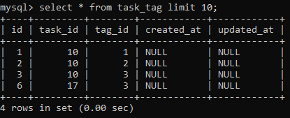

# Лабораторная работа №3. Основы работы с базами данных в Laravel

### №1. Подготовка к работе

Выбор базы данных пал на MySQL. Подключиться к созданной БД удалось через настройку файла `.env`.

### №2. Создание моделей и миграций

Управлять созданием файлов легко пользуясь терминалом в корне проекта.

Модель `Category` создается следующей командой: `php artisan make:model Category -m`

Вместе с моделью появляется и миграция, которой необходимо настроить следующие поля:

```php
Schema::create('categories', function (Blueprint $table) {
            $table->id();
            $table->string('name');           // Название категории
            $table->text('description');      // Описание категории
            $table->timestamps();             // created_at и updated_at
        });
```

Аналогично создаются модели `Task` и `Tag`, структуры таблиц в миграциях выглядят следующим образом:

```php
Schema::create('tasks', function (Blueprint $table) {
$table->id();
$table->string('title');           // Название задачи
$table->text('description');       // Описание задачи
$table->timestamps();              // created_at и updated_at
});
```

```php
Schema::create('tags', function (Blueprint $table) {
            $table->id();
            $table->string('name');     // Название тега
            $table->timestamps();       // created_at и updated_at
        });
```

Для применения всех миграций в терминале прописывается команда:
- `php artisan migrate`

Также в моделях необходимо прописать поле `$fillable`, которое определяет массив полей, которые можно безопасно заполнить при массовом заполнении данных в таблицы.

Для модели `Category`: `$fillable = ['name', 'description'];`

Для модели `Tag`: `$fillable = ['name'];`

Для модели `Task`: `$fillable = ['title', 'description', 'category_id'];` 

### №3. Связь между таблицами

Создадим новую миграцию для добавления поля `category_id` в таблицу **task**.
- `php artisan make:migration add_category_id_to_tasks_table --table=tasks`

**Важно!** Опция `--table=tasks` указывает, что миграция должна изменить существующую таблицу с именем **tasks**, а не создавать новую.

Схема в миграции будет выглядеть так:
```php
Schema::table('tasks', function (Blueprint $table) {
            $table->unsignedBigInteger('category_id');
            $table->foreign('category_id')->references('id')->on('categories')->onDelete('cascade');
        });
```

Следующий шаг - создать промежуточную таблицу для связи многие ко многим между задачами и тегами:
- `php artisan make:migration create_task_tag_table`

Схема следующая:
```php
public function up(): void
    {
        Schema::create('task_tag', function (Blueprint $table) {
            $table->id();
            $table->foreignId('task_id')->constrained()->onDelete('cascade');  // Внешний ключ на tasks
            $table->foreignId('tag_id')->constrained()->onDelete('cascade');   // Внешний ключ на tags
            $table->timestamps();
        });
    }
```

Не забываем применить миграцию для внесённых изменений.

### №4. Связи между моделями

Добавление отношений в модели позволит использовать механизм **ORM** для работы с данными более внятным способом.

Модель `Category` и связь "один ко многим" с моделью `Task`:
```php
public function tasks()
    {
        return $this->hasMany(Task::class);
    }
```

Модель `Task` и связь "многие к одному" с моделью `Category` и "многие ко многим" с моделью `Tag`:
```php
public function category()
    {
        return $this->belongsTo(Category::class);
    }

public function tags()
    {
        return $this->belongsToMany(Tag::class, 'task_tag');
    }
```

Модель `Tag` и связь "многие ко многим" с моделью `Task`:
```php
public function tasks()
    {
        return $this->belongsToMany(Task::class, 'task_tag');
    }
```

### №5. Создание фабрик и сидов

Создадим фабрику для модели `Category`:
- `php artisan make:factory CategoryFactory --model=Category`

Со следующей структурой:
```php
public function definition()
    {
        return [
            'name' => $this->faker->word,  // случайное слово
            'description' => $this->faker->sentence,  // случайное предложение
        ];
    }
```

Она указывает на то, какие поля будут генерироваться и какую информацию в них мы хотим увидеть.

Аналогично создаются фабрики для `Task` с полями:
```php
return [
            'title' => $this->faker->sentence,
            'description' => $this->faker->paragraph,
            'category_id' => Category::factory(),  // связь с категорией
        ];
```

И для `Tag`:
```php
return [
            'name' => $this->faker->word,
        ];
```

Следующий этап - сиды (`seeders`).

Для каждой модели создадим отдельный сидер и заполним его данными. На примере`CategorySeeder`:
- `php artisan make:seeder CategorySeeder`
```php
public function run(): void
    {
        Category::factory()->count(10)->create();
    }
```
Что означает - таблица будет заполнена десятью категориями.

Чтобы поднять настроенные сидеры воспользуемся уже существующим файлом `DatabaseSeeder.php`:
```php
public function run(): void
    {
        $this->call([
            CategorySeeder::class,
            TaskSeeder::class,
            TagSeeder::class,
        ]);
    }
```
И запустить их:
- `php artisan db:seed`

Проверим, что изменилось внутри таблиц.

Таблица категорий:


Таблица тегов:


Таблица задач (немного поплыла из-за разрешения экрана):


Таблица, связывающая таски и теги вместе:



### №6. Работа с контроллерами и представлениями

Изменим `TaskController` для взаимодействия с БД.

Обновим метод `index` чтобы он брал список задач из базы данных, а не статически, как это было ранее:
```php
public function index()
    {
        $tasks = Task::with(['category'])->get();

        // Отображаем представление, передавая задачи
        return view('index', compact('tasks'));
    }
```

Метод `show` для конкретной задачи:
```php
public function show($id)
    {
        $task = Task::with(['category', 'tags'])->findOrFail($id);

        return view('show', compact('task'));
    }
```

Придется изменить и представления во `views`.

`index.blade.php` теперь использует цикл для вывода:
```php
<h2>Список задач</h2>

    <ul>
        @foreach ($tasks as $task)
            <li>
                <a href="{{ route('tasks.show', $task->id) }}">{{ $task->title }}</a>
                <span class="category">Категория: {{ $task->category->name }}</span>
                <span class="category">Описание категории: {{ $task->category->description }}</span>
            </li>
        @endforeach
    </ul>
```


`show.blade.php` теперь выглядит так:
```php
    <x-task
        :id="$task->id"
        :title="$task->title"
        :description="$task->description"
        :created_at="$task->created_at"
        :updated_at="$task->updated_at"
        :category="$task->category->name"
        :category_description="$task->category->description"
        :tags="$task->tags->pluck('name')->join(', ')"
    />
```


Осталось изменить методы, которые будут взаимодействовать с базой данных путем её изменения.

Метод `create`:
```php
public function create()
    {
        $categories = Category::all();  // Получаем все категории
        $tags = Tag::all();  // Получаем все теги

        return view('create', compact('categories', 'tags'));
    }
```

Также в представлении `create.blade.php` обязательно укажем момент из формы, где видно что именно достаётся из контроллера с помощью цикла `@foreach`:
```php
<select name="category_id" id="category_id" required>
            @foreach ($categories as $category)
                <option value="{{ $category->id }}">{{ $category->name }}</option>
            @endforeach
        </select>
```
И аналогично для тегов.


Метод `store` для сохранения изменений:
```php
public function store(Request $request)
    {
        $task = Task::create([
            'title' => $request->input('title'),
            'description' => $request->input('description'),
            'category_id' => $request->input('category_id'),
        ]);

        // Привязываем теги к задаче
        $task->tags()->sync($request->input('tags'));

        return redirect()->route('tasks.index');
    }
```
И вызывается он в той же форме так:
```php
<form action="{{ route('tasks.store') }}" method="POST">
```

Метод `edit` для редактирования задачи:
```php
public function edit($id)
    {
        $task = Task::with(['category', 'tags'])->findOrFail($id);
        $categories = Category::all();
        $tags = Tag::all();

        return view('edit', compact('task', 'categories', 'tags'));
    }
```


Соответствующий `update`:
```php
public function update(Request $request, $id)
    {
        $task = Task::findOrFail($id);
        $task->update([
            'title' => $request->input('title'),
            'description' => $request->input('description'),
            'category_id' => $request->input('category_id'),
        ]);

        $task->tags()->sync($request->input('tags'));

        return redirect()->route('tasks.index');
    }
```
Который вызывается в представлении `edit.blade.php` следующим образом:
```php
<form action="{{ route('tasks.update', $task->id) }}" method="POST">
```

Наконец, метод `destroy` для удаления задачи:
```php
public function destroy($id)
    {
        $task = Task::findOrFail($id);
        $task->delete();

        return redirect()->route('tasks.index');
    }
```
Вызывающийся в представлении конкретной задачи с помощью:
```php
<form action="{{ route('tasks.destroy', $id) }}" method="POST" class="delete-form">
```