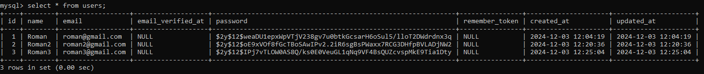
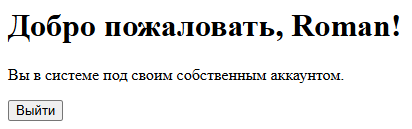
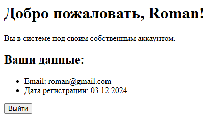
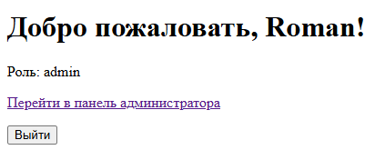
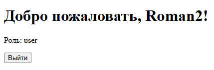
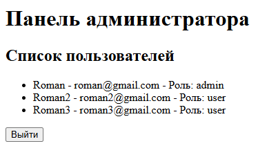

# Лабораторная работа №5. Компоненты безопасности в Laravel

## Цель работы

Познакомиться с основами компонентов безопасности в Laravel, таких как **аутентификация**, **авторизация**, **защита от CSRF**, а также использование встроенных механизмов для управления доступом.

Освоить подходы к безопасной разработке, включая создание защищенных маршрутов и управление ролями пользователей.

### №1. Подготовка к работе

Для лабораторной работы №5 было принято решение создать новый проект и базу данных `lab5`.

```bash
composer create-project laravel/laravel:^10 lab_5_recovery
```

### №2. Аутентификация пользователей

1. Создадим контроллер `AuthController` для управления аутентификацией пользователей.

```bash
php artisan make:controller AuthController
```

2. Реализуем методы для регистрации, входа и выхода пользователя.

Отображение формы регистрации:
```php
public function register()
    {
        return view('register');
    }
```

Обработка формы регистрации:
```php
public function storeRegister(Request $request)
    {
        $validatedData = $request->validate([
            'name' => 'required|string|max:25',
            'email' => 'required|string|email|max:35|unique:users',
            'password' => 'required|string|min:6|confirmed',
        ]);

        $user = User::create([
            'name' => $validatedData['name'],
            'email' => $validatedData['email'],
            'password' => Hash::make($validatedData['password']),
        ]);

        Auth::login($user);

        return redirect()->route('home');
    }
```

Отображение формы входа:
```php
public function login()
    {
        return view('login');
    }
```

Обработка формы входа:
```php
public function storeLogin(Request $request)
    {
        $credentials = $request->validate([
            'email' => 'required|string|email',
            'password' => 'required|string',
        ]);

        if (Auth::attempt($credentials)) {
            $request->session()->regenerate();

            return redirect()->route('home');
        }

        return back()->withErrors([
            'email' => 'Неверные учетные данные.',
        ])->onlyInput('email');
    }
```

Выход из системы:
```php
public function logout(Request $request)
    {
        Auth::logout();

        $request->session()->invalidate();
        $request->session()->regenerateToken();

        return redirect()->route('login');
    }
```

3. Создадим маршруты для регистрации, входа и выхода.

Перейдём в директорию routes/web.php и настроим следующие параметры:

```php
Route::get('/register', [AuthController::class, 'register'])->name('register');
Route::post('/register', [AuthController::class, 'storeRegister']);

Route::get('/login', [AuthController::class, 'login'])->name('login');
Route::post('/login', [AuthController::class, 'storeLogin']);

Route::post('/logout', [AuthController::class, 'logout'])->name('logout');
```

Дополнительно укажем маршрут на хоум-page, куда будет перебрасывать после успешной регистрации/логина.
```php
Route::get('/home', function () {return view('home');})->name('home');
```
Здесь будет использована анонимная функция, т.к. маршрут простой и нужен просто для отображения страницы.

4. Создадим представления для страниц:
   - `register.blade.php`
   - `login.blade.php`
   - `home.blade.php`

Тут важно отметить несколько пунктов:

- В представлении регистрации форма будет обрабатываться:
    ```php
    <form action="{{ route('register') }}" method="POST">
    ``` 
  
- В представлении логина форма будет обрабатываться:
    ```php
    <form action="{{ route('login') }}" method="POST">
    ```

- В представлении `home` выведем имя пользователя.
    ```php
    <h1>Добро пожаловать, {{ Auth::user()->name }}!</h1>
    ```
  
- В представлении `home` добавим возможность сделать `logout`:
    ```php
    <form action="{{ route('logout') }}" method="POST">
    ```

5. Проверим, что все работает корректно:

После нескольких регистраций проверим таблицу `users` в базе данных.



Попробуем залогиниться через представление `login`:



### №4. Авторизация пользователей

1. Страница "home page", доступ к которой имеют только авторизованные пользователи уже реализована выше.
2. Настроим проверку доступа к данной странице, добавив middleware `auth` в маршрут.

В файле `routes/web.php` изменим:
```php
Route::get('/home', function () {return view('home');})->name('home')->middleware('auth');
```

3. Обновим представление домашней страницы. 

Из прошлой части уже был показан вывод личной информации (имя пользователя), доступной исключительно авторизованным пользователям. Однако можно добавить еще:

```php
<h2>Ваши данные:</h2>
<ul>
    <li>Email: {{ Auth::user()->email }}</li>
    <li>Дата регистрации: {{ Auth::user()->created_at->format('d.m.Y') }}</li>
</ul>
```

Итак, `home.blade.php` выглядит:



### №5. Роли пользователей

**Шаг 1:** Для начала нужно добавить поле для роли в таблицу пользователей, чтобы хранить информацию о роли каждого пользователя. Мы добавим столбец role в таблицу users.

1. Создадим миграцию для добавления столбца `role`:

```bash
php artisan make:migration add_role_to_users_table --table=users
```

2. В созданной миграции добавим код для добавления столбца `role`:

```php
public function up()
{
    Schema::table('users', function (Blueprint $table) {
        $table->string('role')->default('user');
    });
}
```

И в функции `down() ` добавим:
```php
$table->dropColumn('role');
```

3. Применим миграции:

```bash
php artisan migrate
```

**Шаг 2:** Настройка модели `User`.

Откроем файл `app/Models/User.php` и добавим метод `isAdmin()`:

```php
protected function isAdmin()
{
    return $this->role === 'admin';
}
```

Тут мы будем проверять, является ли пользователь администратором.

**Шаг 3:** Использование `middleware` для проверки ролей.

Создадим `middleware`:

```bash
php artisan make:middleware CheckRole
```

Настроим созданный класс в `app/Middleware/CheckRole.php`:

```php
class CheckRole
{
    public function handle(Request $request, Closure $next, $role)
    {
        if (Auth::check() && Auth::user()->role === $role) {
            return $next($request);
        }
        
        // В противном случае
        return redirect()->route('home');
    }
}
```

Зарегистрируем `middleware` в файле `app/Http/Kernel.php`:

```php
protected $routeMiddleware = [
    'role' => \App\Http\Middleware\CheckRole::class,
];
```

**Шаг 4:** Создадим контроллер с представлением для админки и настроем маршрут:

```bash
php artisan make:controller AdminController
```

```php
Route::get('/admin', [AdminController::class, 'index'])->name('admin')->middleware('role:admin');
```

В контроллере добавим метод `index`, , который будет возвращать представление для администраторов.

```php
class AdminController extends Controller
{
    public function index()
    {
        $users = User::all();
        return view('admin', compact('users'));
    }
}
```

Представление `admin.blade.php` будет включать вывод информации о всех юзерах, существующих в БД.

```php
<ul>
     @foreach($users as $user)
         <li>{{ $user->name }} - {{ $user->email }} - Роль: {{ $user->role }}</li>
     @endforeach
</ul>
```

Чтобы попасть в панель администратора добавим ссылку на переход на странице `/home`:

```php
@if(Auth::user()->isAdmin())
    <p><a href="{{ route('admin') }}">Перейти в панель администратора</a></p>
@endif
```

То есть получается так, если пользователь простой юзер - он просто не увидит ссылку на переход в админ-панель.

**Шаг 5:** Проверка.

Зададим пользователю с `ID:1` права администратора через `tinker`:

```php
php artisan tinker

$user = \App\Models\User::find(1);
$user->role = 'admin';
$user->save();
```

Попробуем залогиниться под аккаунтом с `ID:1`:



Залогинимся под `ID:2`:



Перейдем в панель администратора из аккаунта с `ID:1` и проверим что выведется в приложении:



В панели вывелась личная информация о всех пользователях из базы данных - все работает.

Добавим немного стилей и лабораторная работа завершена.
